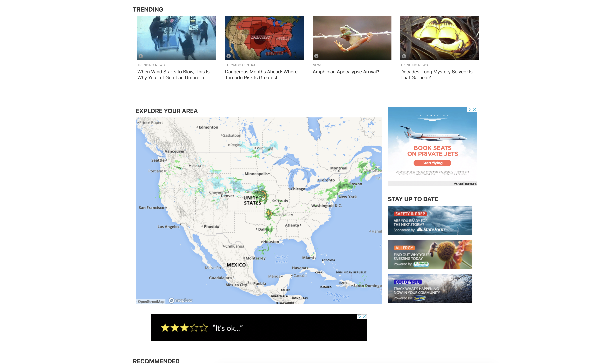

# _Clone of Weather.com_

_Published_ **March 29th 2018** 
_Author_ **Nate Wessels**

1. [Description](#description)
1. [Installation](#installation)
1. [Known Bugs](#known-bugs)
1. [Technologies Used](#technologies-used)
1. [License](#license)

### Description

_This Application will show a cloned version of the Weather Channel Website. It is using the Angular framework. This application shows the use of inputs and outputs between child and parent components_

### Specs

_This application will display a cloned version of the "www.weather.com" website using angular_

### Real Website

#### Top of the Real Website

#### Body of the Real Website

#### Footer of the Real Website

### Cloned Webiste

#### Top of the Cloned Website

#### Body of the Cloned Website

#### Footer of the Cloned Website

### Installation
_Below are the steps to follow to install this application_
  1. First Make sure that you have installed NPM on your device. Follow the instructions on https://www.npmjs.com/get-npm if you have not.
  2. Next we need to install the repository onto this device. Go to your terminal
  3. Type in `cd desktop`
  4. Now to get the repository from Github we need to clone it from the website. To do that type in `git clone https://github.com/ngwessels/angular-project`
  5. Once its finished installing, type in `npm install`. This will download any developer/dependencies from its package.json file. This step may take a few minutes
  6. Once finished type in `ng serve --open` to open it in your browser

###Features
_Below is a list of features this application has_
  1. Angular framework
  2. Firebase Realtime database

###Possible Features in the Future
_Below is a list of planned features that have not been worked on yet_
  1. Firebase Storage. Storing all photos
  2. API Call getting realtime weather Informatio

### Known Bugs
* None identified

### Support and Contact Details

_Contact Nate Wesses at nwessels16@gmail.com_

### Technologies Used
* HTML
* Javascript / TypeScript
* Angular
* SCSS

### License

_Copyright (c) 2019 Nate Wessels, Epicodus_

_Permission is hereby granted, free of charge, to any person obtaining a copy of this software and associated documentation files (the "Software"), to deal in the Software without restriction, including without limitation the rights to use, copy, modify, merge, publish, distribute, sublicense, and/or sell copies of the Software, and to permit persons to whom the Software is furnished to do so, subject to the following conditions:_

_The above copyright notice and this permission notice shall be included in all copies or substantial portions of the Software._

_THE SOFTWARE IS PROVIDED "AS IS", WITHOUT WARRANTY OF ANY KIND, EXPRESS OR IMPLIED, INCLUDING BUT NOT LIMITED TO THE WARRANTIES OF MERCHANTABILITY, FITNESS FOR A PARTICULAR PURPOSE AND NONINFRINGEMENT. IN NO EVENT SHALL THE AUTHORS OR COPYRIGHT HOLDERS BE LIABLE FOR ANY CLAIM, DAMAGES OR OTHER LIABILITY, WHETHER IN AN ACTION OF CONTRACT, TORT OR OTHERWISE, ARISING FROM, OUT OF OR IN CONNECTION WITH THE SOFTWARE OR THE USE OR OTHER DEALINGS IN THE SOFTWARE._
